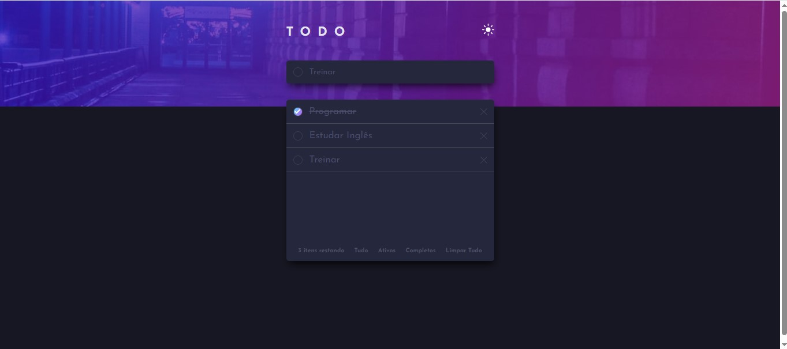
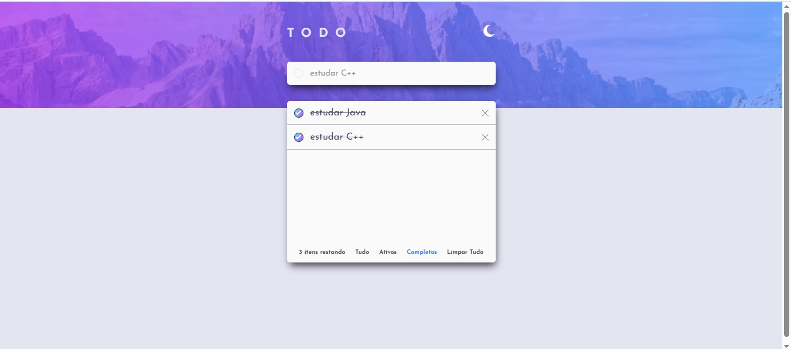
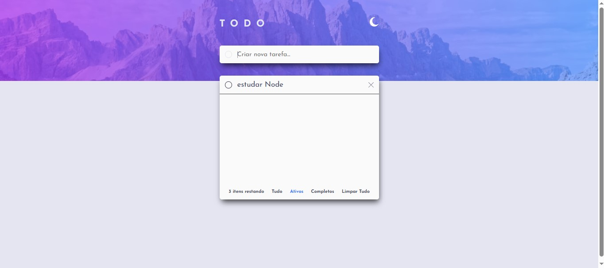

# Frontend Mentor - Todo app solution

Esta é a minha solução para o [Desafio Todo App no Frontend Mentor](https://www.frontendmentor.io/challenges/todo-app-Su1_KokOW). Esse desafio ajuda a praticar habilidades fundamentais de front-end com HTML, CSS e JavaScript puro, criando um aplicativo funcional e responsivo.

## Índice

- [Visão geral](#visão-geral)
  - [O desafio](#o-desafio)
  - [Screenshot](#screenshot)
  - [Links](#links)
- [Meu processo](#meu-processo)
  - [Construído com](#construído-com)
  - [O que aprendi](#o-que-aprendi)
  - [Continuação do desenvolvimento](#continuação-do-desenvolvimento)
- [Autor](#autor)

---

## Visão geral

### O desafio

Os usuários devem ser capazes de:

- Adicionar novas tarefas
- Marcar tarefas como concluídas
- Deletar tarefas
- Filtrar tarefas por: todas / ativas / concluídas
- Limpar todas as tarefas
- Alternar entre temas claro e escuro
- Ver o layout adaptado para desktop e mobile

### Screenshot

### Links

- Repositório: [GitHub](https://github.com/dhBarankievicz/frontend-mentor-Todo-App)

---

## Meu processo

### Construído com

- HTML5 semântico
- CSS3 com variáveis e transições
- Flexbox e Media Queries
- JavaScript puro (sem frameworks)

### O que aprendi

Esse projeto reforçou várias práticas importantes:

- Alternância de tema claro/escuro
- Manipulação do DOM com JavaScript
- Uso de addEventListener, classList, querySelectorAll
- Filtros dinâmicos por estado (todos, ativos, completos)
- Boas práticas de organização de código

### Continuação do desenvolvimento

- Implementar localStorage para salvar as tarefas entre sessões
- Adicionar função de drag and drop (opcional bônus do desafio)

### Autor

- [Github](https://github.com/dhBarankievicz)

### Obrigado por visitar meu projeto! 😊

